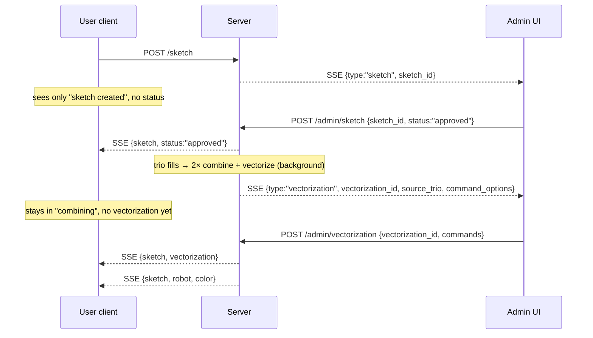

# v2 Admin Workflow — Frontend Integration Guide

This document is the whole contract for building the **admin front-end** that
moderates the DoodleBot v2 pipeline. It covers every endpoint you talk to, the
exact wire shapes, the event lifecycle, auth, and the edge cases.

Implementation reference: [release/v2.py](v2.py).

---

## 1. Mental model

Every drawing passes through **two human approval gates** before it can reach a
robot:

1. **Sketch gate** — a user submits a sketch. It is withheld from *everyone*
   (the submitting client sees nothing but "your sketch exists") until an admin
   rules on it. The verdict (`approved` / `innapropriate` / `complex`) is what
   the client finally sees.
2. **Vectorization gate** — three approved sketches are grouped into a trio and
   combined **twice** (two independent GPT Image 1 runs, each vectorized into
   robot strokes), producing **two command-list options**. Both options — plus
   the three source sketch ids — are withheld from the trio's clients and sent to
   an admin, who **picks the better option and trims any unnecessary parts**. The
   chosen list is drawable as-is; only then does it get served to clients and
   dispatched to a robot.

The admin does **not** poll. It opens **one SSE stream** (`GET /admin/events`)
and receives everything that needs a verdict. It replies on two POST endpoints,
echoing back the id it was given. Those ids (`sketch_id`, `vectorization_id`)
are opaque **resource locators** — the server resolves each to the exact pending
entity. The admin holds no session state.



---

## 2. Authentication

Both admin POST endpoints **and** the admin SSE stream are gated by
`require_admin` (see [release/common.py](common.py)). Supply the token
one of two ways:

| Method | How |
| --- | --- |
| Header | `X-Admin-Token: <token>` |
| Query param | `?token=<token>` |

The token is the `ADMIN_TOKEN` env var (default `"test"` in dev — override in
production). A wrong/missing token returns **`401 Unauthorized`**.

> **`EventSource` caveat:** the browser `EventSource` API cannot set custom
> headers, so the SSE stream must authenticate via the **query param**:
> `new EventSource('/admin/events?token=' + TOKEN)`. The token therefore appears
> in the URL — serve the admin UI over HTTPS and treat the token as a secret.

> **CORS:** the app restricts origins to `https://mitmedialab.github.io` and
> `http://localhost:5173` ([release/app.py](app.py)). Add the admin
> UI's origin there, or serve it from one of those.

---

## 3. Wire types

All payloads are JSON. Here they are as TypeScript (fields marked `?` are
**omitted entirely** when null — the server serializes with `exclude_none`, so
`undefined`-check them, don't expect explicit `null`).

```ts
// The three moderation verdicts. Note the intentional "innapropriate" spelling.
type SketchStatus = "approved" | "innapropriate" | "complex";

// Robot drawing commands — a discriminated union on `kind`.
type DrawingCommand =
  | { kind: "line"; distance: number; penDown: boolean }
  | { kind: "spin"; degrees: number }
  | { kind: "arc";  radius: number; degrees: number };

// ---- What the ADMIN stream delivers (discriminate on `type`) ----
type AdminEvent = AdminSketchEvent | AdminVectorizationEvent;

interface AdminSketchEvent {
  type: "sketch";
  sketch_id: string;            // also a /resource/{id} locator for the PNG
}

interface AdminVectorizationEvent {
  type: "vectorization";
  vectorization_id: string;     // locator; the served SVG appears here once chosen
  source_trio: [string, string, string];        // the 3 source sketch ids (PNG locators)
  command_options: [DrawingCommand[], DrawingCommand[]]; // two options to choose from
}

// ---- What the ADMIN posts back ----
interface AdminSketchResponse {
  sketch_id: string;
  status: SketchStatus;         // "approved" moves it forward; others are terminal
}

interface AdminVectorizationResponse {
  vectorization_id: string;
  commands: DrawingCommand[];   // the chosen option, optionally trimmed; drawn as-is
}

// ---- What the USER client stream delivers (for reference/testing) ----
interface ClientSSEPayload {
  sketch: string;
  status?: SketchStatus;
  companions?: string[];
  vectorization?: string;       // resource id of the chosen SVG
  robot?: string;
  color?: string;
}
```

---

## 4. Endpoints

### `GET /admin/events` — the approval feed (SSE)

Open one long-lived `text/event-stream` connection.

- **Auth:** required (use `?token=`).
- **On connect** you receive a **snapshot of the current backlog** — every item
  still awaiting a verdict — in this order: pending **sketches** first, then
  pending **vectorizations**. After the snapshot you receive **live** items as
  they arise. The backlog is *outstanding work only*: once an item is resolved it
  is never replayed, so a reconnect gives you exactly what's still open (no
  de-dup bookkeeping needed on your side).
- **Frame format:** standard SSE. Data frames are `data: <json>\n\n`; there is
  **no** `event:` line — discriminate on the JSON `type` field. Comment frames
  `: connected\n\n` and `: keep-alive\n\n` (every ~15s) are sent to keep the
  connection alive; `EventSource` ignores them automatically.

```js
const es = new EventSource(`/admin/events?token=${TOKEN}`);
es.onmessage = (e) => {
  const evt = JSON.parse(e.data);           // AdminEvent
  if (evt.type === "sketch")        queueSketch(evt.sketch_id);
  else if (evt.type === "vectorization")
    queueVectorization(evt.vectorization_id, evt.source_trio, evt.command_options);
};
es.onerror = () => { /* EventSource auto-reconnects; you'll be re-sent the backlog */ };
```

### `POST /admin/sketch` — rule on a sketch

- **Auth:** required. **Body:** `AdminSketchResponse`. **Returns:** `{ "success": true }`.
- `status: "approved"` → the sketch enters trio grouping; the client is told
  `status:"approved"`.
- `status: "innapropriate"` | `"complex"` → **terminal**. The client is told the
  verdict and the sketch never groups.

**Errors:** `404` unknown `sketch_id`; `409` the sketch is not awaiting approval
(already resolved, or was never pending); `401` bad token.

```js
await fetch(`/admin/sketch?token=${TOKEN}`, {
  method: "POST",
  headers: { "Content-Type": "application/json" },
  body: JSON.stringify({ sketch_id, status: "approved" }),
});
```

### `POST /admin/vectorization` — choose a vectorization

- **Auth:** required. **Body:** `AdminVectorizationResponse`. **Returns:**
  `{ "success": true }` **immediately** — the render + robot dispatch runs in the
  background after the response.

Send the single command list you want drawn. This is normally one of the two
`command_options` you were given, with any unnecessary parts trimmed — but any
valid `DrawingCommand[]` is accepted. It is re-vectorized to an SVG, stored at
`vectorization_id`, revealed to the trio's clients, and dispatched to a robot.
There is **no** reject/approve flag: every response is a drawable choice.

**Errors:** `404` unknown or already-resolved `vectorization_id`; `401` bad token.

```js
// Pick option 0 and trim it before submitting.
const chosen = command_options[0].filter(keepThisCommand);
await fetch(`/admin/vectorization?token=${TOKEN}`, {
  method: "POST",
  headers: { "Content-Type": "application/json" },
  body: JSON.stringify({ vectorization_id, commands: chosen }),
});
```

### `GET /resource/{resource_id}` — fetch an image (no auth)

A `307` redirect to a presigned S3 URL. Use it directly as an ``/`<object>`
source; the browser follows the redirect and caches the bytes.

- **A `sketch_id` is a resource id.** `GET /resource/{sketch_id}` serves the
  submitted **PNG** — use it to show the admin the sketch under review.
- **A `vectorization_id` becomes a resource only *after* you choose.** Before
  then there is no served blob (the bytes don't exist yet — you pick + trim the
  commands), so render your previews **client-side from `command_options`**. Once
  chosen, `GET /resource/{vectorization_id}` serves the **SVG** of your choice.

---

## 5. Rendering `DrawingCommand[]` for preview

The commands describe a pen that starts at the origin facing +x and executes,
in order (this mirrors the server's SVG renderer and the robot's renderer):

- `spin{degrees}` — rotate in place by `degrees` (CCW positive). No movement.
- `line{distance, penDown}` — move forward `distance`; draw a segment only if
  `penDown` is true (otherwise it's a travel move).
- `arc{radius, degrees}` — sweep a circular arc of the given `radius` through
  `degrees`; always drawn. Positive `radius`/`degrees` curve one way, negative
  the other.

For each of the two `command_options`, walk the list maintaining
`(x, y, heading)` and emit an SVG path (skip pen-up `line`s) so the admin can
compare them side by side against the source sketches. The server does exactly
this in `_render_commands_svg` → `commands_to_svg`
([release/arc_line_vectorization_suede/visualize.py](arc_line_vectorization_suede/visualize.py))
if you want a byte-for-byte reference. The "trim" feature is: let the admin
delete/edit entries in the chosen array and POST that list back as `commands`.

---

## 6. Lifecycle & state notes

- **Ordering within a trio.** After you approve the 3rd sketch of a trio, the
  server runs **two** combine+vectorize passes in the background (two OpenAI
  calls, so expect a few seconds) before the single `vectorization` event
  (carrying both options) appears. There is no progress event in between — the
  trio's clients simply sit in "combining".
- **Reconnects are safe.** `EventSource` reconnects automatically; on reconnect
  you get the current backlog again. Because resolved items are never replayed,
  you won't see anything you've already actioned. If you action an item twice
  (e.g. a double-click), the second call returns `404`/`409` — treat those as
  "already handled", not as hard errors.
- **Durability.** In-flight items are **not** resumed across a server restart
  (consistent with the rest of the pipeline). If the server restarts while items
  are pending, those specific items won't reappear on the admin stream. Design
  the UI to tolerate an item silently never resolving rather than assuming every
  emitted item will always be actionable.
- **Sketch rejection is the only client-facing verdict.** A sketch's
  `innapropriate`/`complex` verdict reaches its client via `status`. A
  vectorization has no reject path at all — you always return a drawable list —
  so there's no rejection state to surface for it.

---

## 7. End-to-end reference

For a runnable, commented walkthrough of every path above (submit → sketch
verdict → combine → vectorization verdict → robot), see
[tests/test_v2_admin_flow.py](../tests/test_v2_admin_flow.py). It drives the real
endpoints and asserts exactly the withheld-until-chosen behavior this document
describes.
